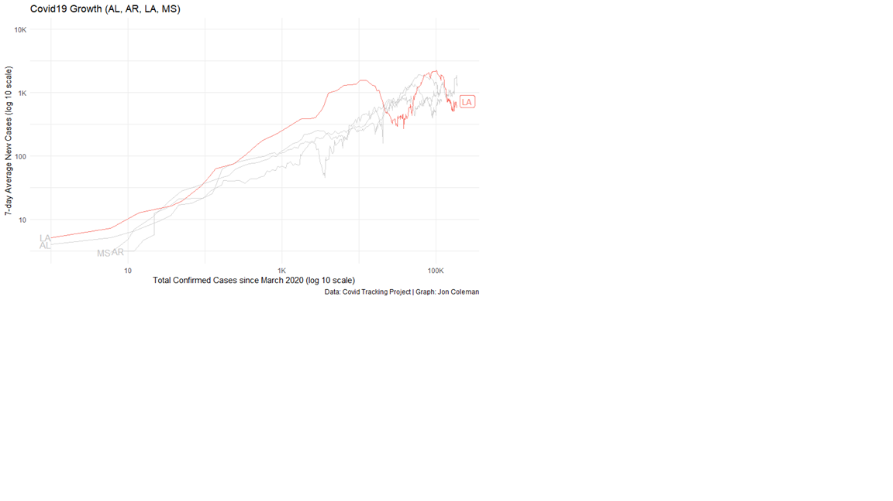
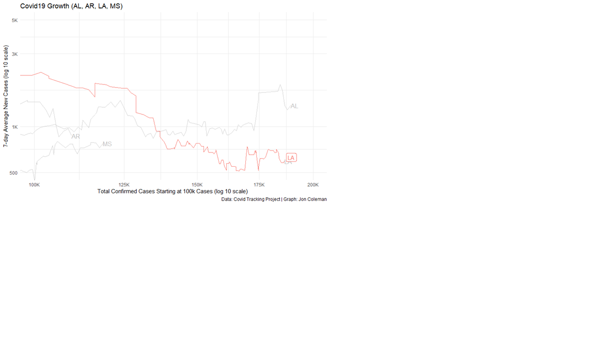
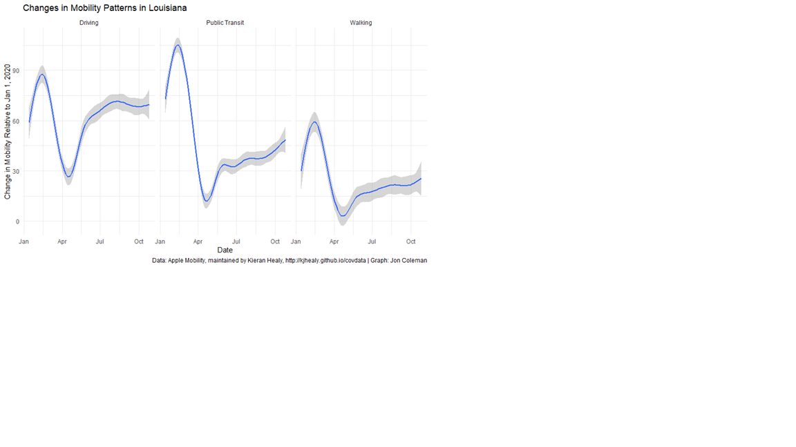
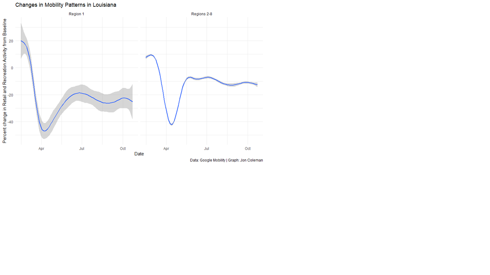
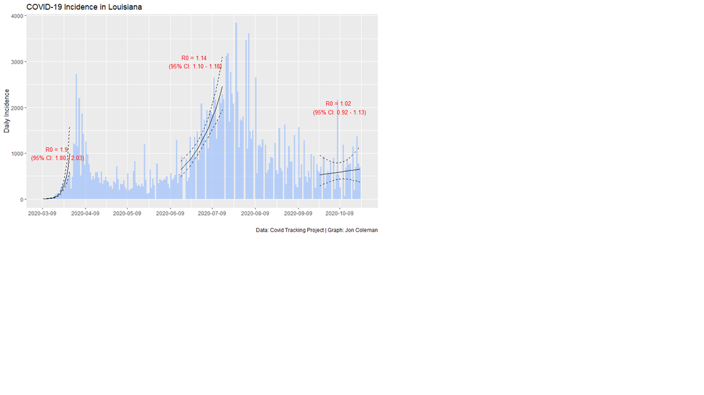
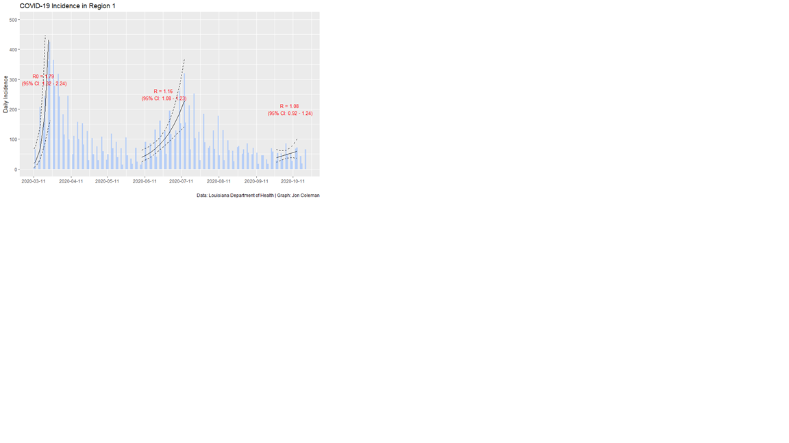
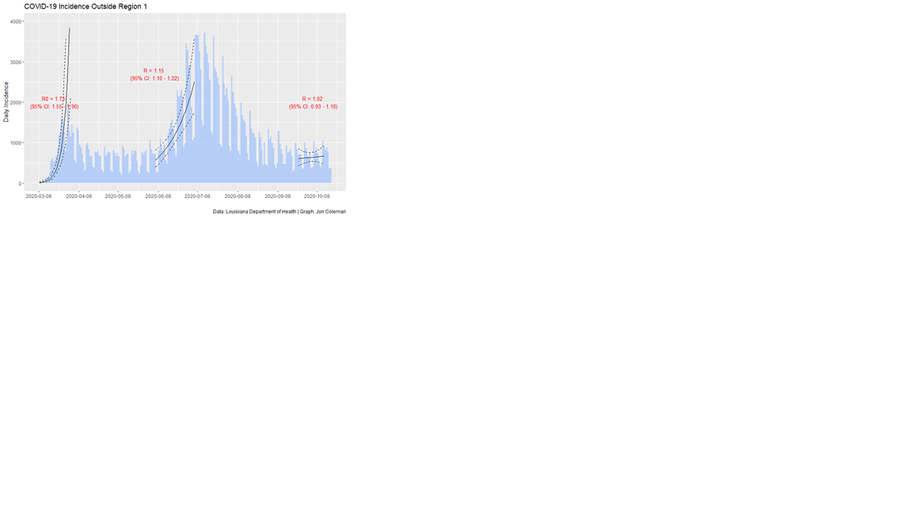

In October/November 2020, I had the opportunity to work with with the Pandemic Clinical Advisory Workgroup (PCAW). Based out of the VA in New Orleans, this group was tasked with everything from Pandemic Response to Vaccine Distribution. During this time, the idea of the vaccines was just starting to become concrete in our minds - it was no longer a matter of if, but rather when and how much would be allotted. The end of October/beginning of November was a pretty stressful time (among a year of stressful times) to be looking into the COVID data and trying to make decisions with it. Were we in a stable and acceptably low plateau or were we on the cusp of a dramatic rise?  

The following is an excerpt from ou weekly PCAW summary (remember this is from the end of October/beginning of November). Also sorry for the potato quality of some of the images:

The line between maintaining the status quo and a resurgence is razor-thin and small cumulative changes can have an outsized impact. Currently, the data shows a mixed picture. There are some data points that are concerning that we are on the cusp of a resurgence in cases (though what this means for hospitalization is unclear) while other data points allow for cautious optimism and allow for the possibility that the status-quo is sustainable:

* Causes for (cautious) optimism:
  * Testing in Region 1 remains at its highest point since the start of the pandemic
  * We have not seen large, persistent spikes with holidays and school openings 
  * Mask-adherence in Region 1 remains on the higher end compared to the rest of the state
  * Louisiana appears to have fallen off the exponential growth curve
  * COVID hospitalizations remain well below previous peaks and our time interval since the previous peak has already exceeded the time between the initial peak and the resurgence over the summer
  * We are likely gaining a better understanding of how Coronavirus spreads

* Reasons for caution:
  * Despite increased testing in Region 1, the 7-day positivity remains around 5%, which is where it was prior to the summer surge with less testing. It is likely that the true positivity before the summer surge was higher, but with the lack of testing we were missing asymptomatic/presymptomatic people.
  * Since the summer peaks, testing has decreased outside Region 1, and as a result, positivity has increased raising the concern that we are missing asymptomatic/presymptomatic cases.
  * Hospitalizations have slowly crept up since October, but remain relatively stable. As is often stated, hospitalization is a lagging indicator

* What is Unclear:
  * The effect of allowing increased gathering size and indoor recreation
  * The effect of colder weather and flu season
  * Tulane has had a robust testing regime, and they will be pausing their testing while students are on break beginning December 4.
  * We are already seeing a post-Halloween spike on Tulane’s campus and it is not clear what type of spillover that will have to the rest of the community. LDH has not published this data as of this update.

* What we can do:
  * Encourage mask use indoors among staff
  * Help staff and patients understand risk vs. benefits of activities. This infographic from Colorado Health Department does a good job of showing risks and benefits, which is often ignored when trying to promote public healthy guidance. It’s from June so it might be a bit outdated. I’m not sure if LDH has something similar, but I wasn’t able to find it. 

### Growth
This is an updated graph from the one sent out in the previous update showing average cases vs cumulative cases as a way to measure whether we have fallen off or remained on the exponential growth curve. Louisiana appears to have remained off the exponential growth curve, while our neighboring states remain much closer to exponential growth.

The problem with comparisons, is that things can look relatively good, but be bad in the absolute sense. A 7-day average of around 1000 cases per week heading into flu season is probably not a good start. [Dr. Fauci said as much](https://www.washingtonpost.com/politics/fauci-covid-winter-forecast/2020/10/31/e3970eb0-1b8b-11eb-bb35-2dcfdab0a345_story.html) during an interview on October 31. So while we can look at other states and say we are doing better, it is not clear if the status-quo is sustainable. 

Louisiana is not a monolith. We can see that in mask-adherence, and we can also see it in mobility data taken from Apple and Android phones and provided by these companies during the pandemic.   Mobility is an important metric as it gives us a rough idea of peoples' comfort with virus prevalence/spread and the risk individuals are willing to take on – especially when we measure shopping/recreation. 

### Drivers of Growth
Louisianans are out of the house more in all 3 metrics measured by Apple Maps – Driving, Public Transit use, and Walking – and is nearly back to the baseline of Jan 1, 2020 with respect to driving and walking. Based on the Google’s Mobility data, Regions 2-8 seem to be driving this recent increase as Region 1 remains further below it’s baseline than the rest of the state. Recreational activities (shopping, dining, etc.) specifically in Region 1 remain ~10 percentage points lower compared to the rest of the state. Both remain below pre-COVID levels and have been relatively stable for the past couple of months.

Louisianans are out of the house more in all 3 metrics measured by Apple Maps – Driving, Public Transit use, and Walking – and is nearly back to the baseline of Jan 1, 2020 with respect to driving and walking. Based on the Google’s Mobility data, Regions 2-8 seem to be driving this recent increase as Region 1 remains further below it’s baseline than the rest of the state. Recreational activities (shopping, dining, etc.) specifically in Region 1 remain ~10 percentage points lower compared to the rest of the state. Both remain below pre-COVID levels and have been relatively stable for the past couple of months.

### Measuring Spread
* Overall, I don’t think we can exclude the possibility that our reproductive value is within the range it was prior to the summer surge, but, small variations up or down can create dramatically different pictures. 

* Most people are familiar with the incidence graph in Louisiana. This is the same graph with three fitted models to take a stab at a rough estimate of the (now infamous) R0 - the expected average number of cases directly generated by a single case in a population where all individuals are susceptible to infection. It goes without saying that these are only rough estimates. The early estimates through the summer are hindered by a lack of available testing as well as delays in turnaround time, data reporting, and there's some mixed evidence that towards the end of the summer, people started seeking less testing. I would not take these to be the true R0 values, but they give some reference for comparison. 

 
